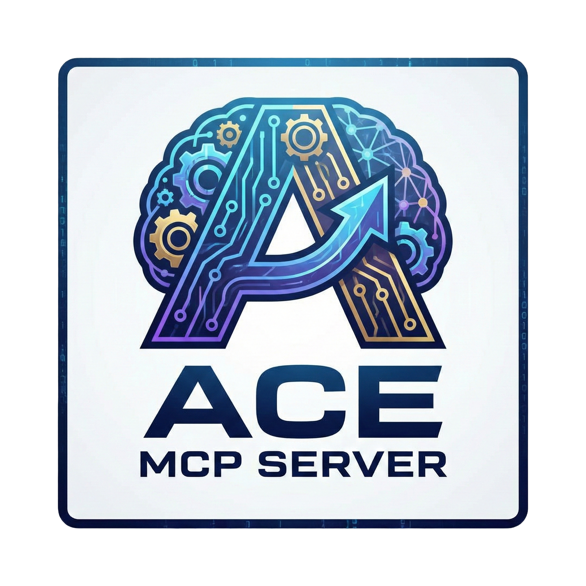

<div align="center">
  
  <h1>ACE MCP Server</h1>
  <p><strong>Agentic Context Engineering</strong> - Self-improving AI context framework</p>
  <p>
    <strong>Version</strong>: 1.0.0 | <strong>License</strong>: MIT
  </p>
</div>

## 🎯 Overview

ACE MCP Server is an intelligent development assistant that learns from your coding patterns and automatically enhances your development workflow. It integrates seamlessly with Cursor AI through the Model Context Protocol (MCP), providing contextual code generation, intelligent analysis, and self-improving recommendations.

### ✨ Key Features

- **🤖 Smart Code Generation** - Context-aware code generation with automatic prompt enhancement
- **🧠 Intelligent Code Analysis** - Deep code analysis with actionable improvement suggestions  
- **📚 Self-Improving Playbook** - Accumulates knowledge and patterns from your development work
- **🔧 Multiple LLM Support** - Works with OpenAI, Anthropic Claude, DeepSeek, Google Gemini, Mistral, and LM Studio
- **🐳 Docker Ready** - Complete containerized solution for local and production deployment
- **🔒 Secure by Default** - Bearer token authentication and comprehensive security measures

### 🚀 What Makes ACE Special

ACE doesn't just generate code - it **learns** from your development patterns and **improves** over time:

1. **Generates** contextual development trajectories
2. **Reflects** on code to extract insights and patterns  
3. **Curates** knowledge into a self-improving playbook
4. **Enhances** future interactions with accumulated wisdom

## 📚 Documentation

### 🚀 Getting Started
- **[Installation Guide](./docs/intro/INSTALLATION.md)** - Complete setup instructions
- **[Project Overview](./docs/intro/START_HERE.md)** - Detailed project introduction
- **[Quick Start](./docs/intro/DESCRIPTION.md)** - Fast track to running ACE

### ⚙️ Setup & Configuration  
- **[Cursor AI Setup](./docs/setup/CURSOR_AI_SETUP.md)** - Basic MCP integration
- **[Enhanced Auto Setup](./docs/setup/CURSOR_AI_AUTO_SETUP.md)** - Smart auto-enhancement features
- **[LLM Providers](./docs/LLM_PROVIDERS.md)** - Configure different AI providers

### 🚀 Deployment
- **[Production Deployment](./docs/deployment/DEPLOYMENT_README.md)** - Deploy to production servers
- **[Full Deployment Guide](./docs/intro/DEPLOYMENT.md)** - Complete Docker deployment guide

### 📖 Project Documentation
- **[Project Status](./docs/intro/PROJECT_STATUS.md)** - Current development status
- **[Architecture](./docs/intro/INITIALIZATION_REPORT.md)** - Technical architecture details
- **[GitHub Setup](./docs/intro/GITHUB_INITIALIZATION.md)** - Repository initialization

## ⚡ Quick Start

### 1. Clone and Setup
```bash
git clone https://github.com/Angry-Robot-Deals/ace-mcp.git
cd ace-mcp
cp .env.example .env
# Edit .env with your configuration
```

### 2. Docker Development
```bash
# Start development environment
docker-compose -f docker-compose.dev.yml up -d

# View logs
docker-compose -f docker-compose.dev.yml logs -f

# Stop environment  
docker-compose -f docker-compose.dev.yml down
```

### 3. Configure MCP Client

Choose your environment for installation:

- **[Cursor AI](#cursor-ai)** - Recommended for AI-powered code editing
- **[Claude Desktop](#claude-desktop)** - For Anthropic's Claude Desktop app
- **[Windsurf](#windsurf)** - For Windsurf IDE
- **[Standalone/CLI](#standalone-cli)** - Run as standalone server

See also detailed setup instructions:
- **[Basic Cursor AI Setup](./docs/setup/CURSOR_AI_SETUP.md)** - Initialize your MCP server with basic ACE tools
- **[Enhanced Auto Setup](./docs/setup/CURSOR_AI_AUTO_SETUP.md)** - Automatically enhance prompts and invoke appropriate ACE methods

### 4. Use ACE Commands
```bash
# Smart code generation
@ace_smart_generate create a REST API endpoint

# Intelligent code analysis  
@ace_smart_reflect [your code here]

# Context-aware assistance
@ace_context_aware optimize database queries domain:database

# Automatic prompt enhancement
@ace_enhance_prompt create secure authentication focus_area:security

# View current playbook
@ace_playbook
```

### 5. View Playbook

The ACE playbook stores accumulated knowledge and patterns from your development work. View it using:

**Option 1: Via API endpoint (JSON)**
```bash
curl -H 'Authorization: Bearer YOUR_TOKEN' \
  http://localhost:34301/api/playbook | python3 -m json.tool
```

**Option 2: Using provided script**
```bash
./view-playbook.sh
```

**Option 3: Via MCP tool in Cursor AI**
```
@ace_playbook
```

**Option 4: Via dashboard**
```
http://localhost:34300
```

The playbook contains:
- **Patterns** - Code patterns and conventions learned from your work
- **Best Practices** - Development best practices accumulated over time
- **Insights** - Key insights extracted from code reflections

## 🛠️ Development

### Prerequisites
- Node.js 18+
- Docker & Docker Compose
- TypeScript

### Local Development
```bash
# Install dependencies
npm install

# Run tests
npm test

# Build project
npm run build

# Start development server
npm run dev
```

### Testing MCP Methods

The test suite validates all 4 MCP methods through the MCP protocol:
- `ace_smart_generate` - Code generation with auto-enhancement
- `ace_smart_reflect` - Code analysis with suggestions
- `ace_context_aware` - Contextual assistance
- `ace_enhance_prompt` - Prompt enhancement

All tests verify:
- ✅ Correct response structure
- ✅ Required fields presence
- ✅ Error handling
- ✅ Tool availability

#### Local Testing
```bash
# Using npm script (recommended)
npm run test:mcp

# Or directly
node test-server.mjs
```

#### Docker Testing
```bash
# Build and start the container
docker-compose up -d ace-server

# Run tests inside the container using npm script
npm run test:mcp:docker

# Or directly
docker exec ace-mcp-server node test-server.mjs

# Or using direct Docker build
docker run --rm -it \
  -v $(pwd)/test-server.mjs:/app/test-server.mjs:ro \
  ace-mcp-server:latest \
  node test-server.mjs
```

**Note:** The test suite automatically detects whether it's running in Docker or locally and adjusts the server path accordingly.

### Docker Management

#### Using Docker Compose (Recommended)

```bash
# Development environment
docker-compose -f docker-compose.dev.yml up -d

# Production environment  
docker-compose up -d

# View service logs
docker-compose logs ace-server
docker-compose logs ace-dashboard

# Rebuild services
docker-compose build --no-cache
```

#### Direct Docker Build (Alternative)

If you prefer to build and run the Docker image directly without `docker-compose`:

```bash
# Build the Docker image
docker build -t ace-mcp-server:latest .

# Run the container
docker run -d \
  --name ace-mcp-server \
  -p 34301:34301 \
  -e LLM_PROVIDER=deepseek \
  -e DEEPSEEK_API_KEY=your-api-key \
  -e ACE_SERVER_PORT=34301 \
  -e API_BEARER_TOKEN=your-secure-token \
  -v ace_contexts:/app/contexts \
  -v ace_logs:/app/logs \
  ace-mcp-server:latest

# View logs
docker logs -f ace-mcp-server

# Stop the container
docker stop ace-mcp-server

# Remove the container
docker rm ace-mcp-server
```

**Note:** When using direct Docker build, you'll need to:
- Create named volumes manually: `docker volume create ace_contexts` and `docker volume create ace_logs`
- Set all required environment variables via `-e` flags or use `--env-file .env`
- Configure networking if you need to connect to other services

## 🔧 Configuration

### LLM Providers & Models

ACE supports 6 LLM providers with various models:

#### Supported Providers

1. **DeepSeek** (Recommended) ⭐
   - Provider: `deepseek`
   - Default Model: `deepseek-chat` (V3.2-Exp)
   - Embedding Model: `deepseek-embedding`
   - Best for: ACE framework performance, cost-effective
   - Pricing: $0.28/1M input, $0.42/1M output tokens
   - Context: 128K tokens, Max output: 32K (reasoner mode)
   - Environment Variables:
     ```bash
     LLM_PROVIDER=deepseek
     DEEPSEEK_API_KEY=sk-your-deepseek-api-key
     DEEPSEEK_MODEL=deepseek-chat
     DEEPSEEK_EMBEDDING_MODEL=deepseek-embedding
     ```

2. **OpenAI**
   - Provider: `openai`
   - Models: `gpt-4o`, `gpt-4`, `gpt-3.5-turbo`
   - Embedding Models: `text-embedding-3-small`, `text-embedding-3-large`
   - Environment Variables:
     ```bash
     LLM_PROVIDER=openai
     OPENAI_API_KEY=sk-your-openai-api-key
     OPENAI_MODEL=gpt-4o
     OPENAI_EMBEDDING_MODEL=text-embedding-3-small
     ```

3. **Anthropic Claude**
   - Provider: `anthropic`
   - Models: `claude-3-5-sonnet-20241022`, `claude-3-opus`, `claude-3-sonnet`, `claude-3-haiku`
   - Environment Variables:
     ```bash
     LLM_PROVIDER=anthropic
     ANTHROPIC_API_KEY=sk-ant-your-api-key
     ANTHROPIC_MODEL=claude-3-5-sonnet-20241022
     ```

4. **Google Gemini**
   - Provider: `gemini`
   - Models: `gemini-1.5-pro`, `gemini-1.5-flash`, `gemini-pro`
   - Environment Variables:
     ```bash
     LLM_PROVIDER=gemini
     GOOGLE_API_KEY=your-google-api-key
     GOOGLE_MODEL=gemini-1.5-pro
     ```

5. **Mistral**
   - Provider: `mistral`
   - Models: `mistral-large-latest`, `mistral-medium-latest`, `mistral-small-latest`
   - Environment Variables:
     ```bash
     LLM_PROVIDER=mistral
     MISTRAL_API_KEY=your-mistral-api-key
     MISTRAL_MODEL=mistral-large-latest
     ```

6. **LM Studio** (Local/Self-hosted)
   - Provider: `lmstudio`
   - Models: Any local model compatible with OpenAI API format
   - Environment Variables:
     ```bash
     LLM_PROVIDER=lmstudio
     LMSTUDIO_BASE_URL=http://localhost:1234/v1
     LMSTUDIO_MODEL=local-model
     ```

### Environment Variables

Copy `.env.example` to `.env` and configure:

```bash
# LLM Provider Selection (required)
# Options: 'deepseek', 'openai', 'anthropic', 'gemini', 'mistral', 'lmstudio'
LLM_PROVIDER=deepseek

# Provider-specific API keys and models (see above for details)
DEEPSEEK_API_KEY=sk-your-deepseek-api-key
DEEPSEEK_MODEL=deepseek-chat

# Server Configuration
ACE_SERVER_PORT=34301
DASHBOARD_PORT=34300
API_BEARER_TOKEN=your-secure-token

# Docker Configuration
COMPOSE_PROJECT_NAME=ace-mcp
DOCKER_BUILDKIT=1
```

For complete configuration options, see `.env.example` file.

---

## Installation & Configuration

### Cursor AI

#### Global Configuration (All Users and Projects) - Recommended

**macOS/Linux:**
1. Create or edit the global MCP configuration file:
```bash
mkdir -p ~/Library/Application\ Support/Cursor/User/globalStorage
nano ~/Library/Application\ Support/Cursor/User/globalStorage/mcp.json
```

2. Add the following configuration:
```json
{
  "mcpServers": {
    "ace-context-engineering": {
      "command": "node",
      "args": ["/absolute/path/to/ace-mcp-server/dist/index.js"],
      "env": {
        "LLM_PROVIDER": "deepseek",
        "DEEPSEEK_API_KEY": "your-deepseek-api-key-here",
        "API_BEARER_TOKEN": "your-secure-bearer-token-here",
        "ACE_LOG_LEVEL": "info",
        "ACE_CONTEXT_DIR": "./contexts"
      }
    }
  }
}
```

**Windows:**
```json
{
  "mcpServers": {
    "ace-context-engineering": {
      "command": "node",
      "args": ["C:\\path\\to\\ace-mcp-server\\dist\\index.js"],
      "env": {
        "LLM_PROVIDER": "deepseek",
        "DEEPSEEK_API_KEY": "your-deepseek-api-key-here",
        "API_BEARER_TOKEN": "your-secure-bearer-token-here"
      }
    }
  }
}
```

**Linux:**
```bash
mkdir -p ~/.config/Cursor/User/globalStorage
nano ~/.config/Cursor/User/globalStorage/mcp.json
```

#### Project-Specific Configuration

Create `.cursor/mcp.json` in your project root:
```json
{
  "mcpServers": {
    "ace-context-engineering": {
      "command": "node",
      "args": ["./ace-mcp-server/dist/index.js"],
      "env": {
        "LLM_PROVIDER": "deepseek",
        "DEEPSEEK_API_KEY": "your-api-key",
        "API_BEARER_TOKEN": "your-token"
      }
    }
  }
}
```

3. **Restart Cursor AI** to apply changes.

---

### Claude Desktop

#### Installation

**macOS:**
```
~/Library/Application Support/Claude/claude_desktop_config.json
```

**Windows:**
```
%APPDATA%\Claude\claude_desktop_config.json
```

**Linux:**
```
~/.config/Claude/claude_desktop_config.json
```

#### Configuration

1. **Create or edit the configuration file:**

**macOS/Linux:**
```bash
mkdir -p ~/Library/Application\ Support/Claude  # macOS
# or
mkdir -p ~/.config/Claude  # Linux

nano ~/Library/Application\ Support/Claude/claude_desktop_config.json  # macOS
# or
nano ~/.config/Claude/claude_desktop_config.json  # Linux
```

**Windows:**
```powershell
New-Item -ItemType Directory -Force -Path "$env:APPDATA\Claude"
notepad "$env:APPDATA\Claude\claude_desktop_config.json"
```

2. **Add ACE configuration:**

```json
{
  "mcpServers": {
    "ace-context-engineering": {
      "command": "node",
      "args": ["/absolute/path/to/ace-mcp-server/dist/index.js"],
      "env": {
        "LLM_PROVIDER": "deepseek",
        "DEEPSEEK_API_KEY": "your-deepseek-api-key-here",
        "API_BEARER_TOKEN": "your-secure-bearer-token-here",
        "ACE_LOG_LEVEL": "info"
      }
    }
  }
}
```

3. **Restart Claude Desktop** to apply changes.

---

### Windsurf

#### Installation

**macOS:**
```
~/Library/Application Support/Windsurf/User/globalStorage/mcp.json
```

**Windows:**
```
%APPDATA%\Windsurf\User\globalStorage\mcp.json
```

**Linux:**
```
~/.config/Windsurf/User/globalStorage/mcp.json
```

#### Configuration

1. **Open Windsurf Settings** → MCP Servers
2. **Add ACE configuration:**

```json
{
  "mcpServers": {
    "ace-context-engineering": {
      "command": "node",
      "args": ["/absolute/path/to/ace-mcp-server/dist/index.js"],
      "env": {
        "LLM_PROVIDER": "deepseek",
        "DEEPSEEK_API_KEY": "your-api-key",
        "API_BEARER_TOKEN": "your-token"
      }
    }
  }
}
```

3. **Restart Windsurf** to apply changes.

---

### Standalone/CLI

#### Running as Standalone Server

You can run ACE MCP Server as a standalone server:

```bash
# Using compiled JavaScript
node /path/to/ace-mcp-server/dist/index.js

# Using tsx (development)
npx tsx /path/to/ace-mcp-server/src/index.ts
```

#### Using with Docker

```bash
# Build and run
docker build -t ace-mcp-server:latest .
docker run -d \
  --name ace-mcp-server \
  -p 34301:34301 \
  -e LLM_PROVIDER=deepseek \
  -e DEEPSEEK_API_KEY=your-api-key \
  -e API_BEARER_TOKEN=your-token \
  ace-mcp-server:latest
```

#### Programmatic Usage

```javascript
import { spawn } from 'child_process';
import { Client } from '@modelcontextprotocol/sdk/client/index.js';
import { StdioClientTransport } from '@modelcontextprotocol/sdk/client/stdio.js';

// Start ACE server
const transport = new StdioClientTransport({
  command: 'node',
  args: ['/path/to/ace-mcp-server/dist/index.js'],
  env: {
    LLM_PROVIDER: 'deepseek',
    DEEPSEEK_API_KEY: 'your-api-key',
    API_BEARER_TOKEN: 'your-token'
  }
});

const client = new Client({
  name: 'my-app',
  version: '1.0.0'
}, {
  capabilities: {}
});

// Connect to server
await client.connect(transport);

// List available tools
const tools = await client.listTools();
console.log('Available tools:', tools.tools.map(t => t.name));

// Call a tool
const result = await client.callTool({
  name: 'ace_smart_generate',
  arguments: {
    prompt: 'Create a REST API endpoint for user authentication'
  }
});

console.log('Generated code:', result.content);
```

---

## Available MCP Tools

ACE MCP Server provides **4 comprehensive tools**:

1. **`ace_smart_generate`** - Automatically generate enhanced code with ACE insights
   - Parameters: `prompt` (required), `context` (optional), `auto_enhance` (optional, default: true)
   - Uses accumulated playbook knowledge to enhance code generation

2. **`ace_smart_reflect`** - Automatically analyze code and suggest improvements
   - Parameters: `code` (required), `auto_suggest` (optional, default: true)
   - Provides actionable improvement suggestions based on best practices

3. **`ace_context_aware`** - Get contextually relevant suggestions
   - Parameters: `query` (required), `domain` (optional)
   - Provides domain-specific assistance (web, api, database, frontend, backend, etc.)

4. **`ace_enhance_prompt`** - Enhance prompts with playbook knowledge
   - Parameters: `prompt` (required), `focus_area` (optional)
   - Automatically improves prompts using accumulated knowledge

---

## 🤝 Contributing

1. **Read the Documentation** - Start with [Project Overview](./docs/intro/START_HERE.md)
2. **Follow Best Practices** - Review [Development Guide](./docs/intro/DESCRIPTION.md)
3. **Submit PRs** - [Follow our contribution guidelines](./docs/CONTRIBUTING.md)

## 📄 License

This project is licensed under the MIT License - see the LICENSE file for details.

## 🔗 Links

- **[GitHub Repository](https://github.com/Angry-Robot-Deals/ace-mcp)**
- **[Issues & Bug Reports](https://github.com/Angry-Robot-Deals/ace-mcp/issues)**
- **[Documentation](./docs/)**

---

**ACE MCP Server - Making AI development smarter, one interaction at a time.** 🚀
